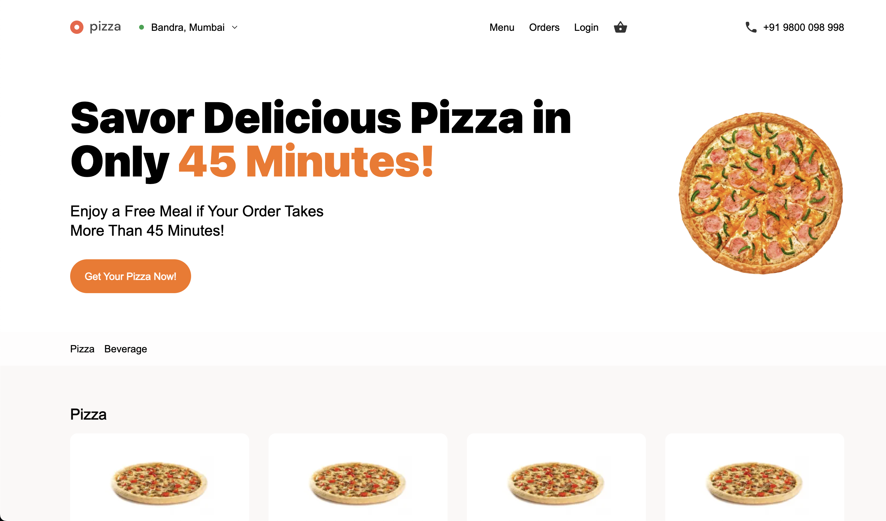
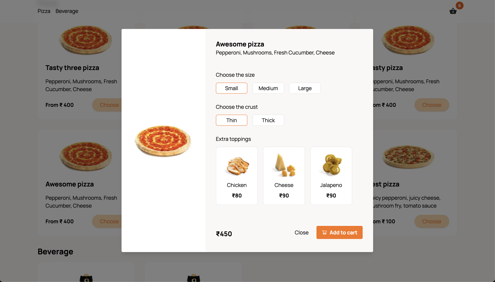
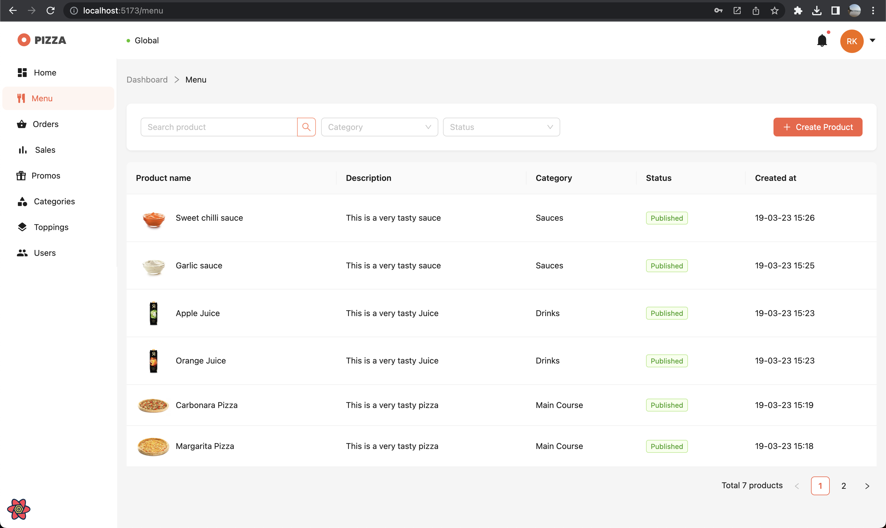
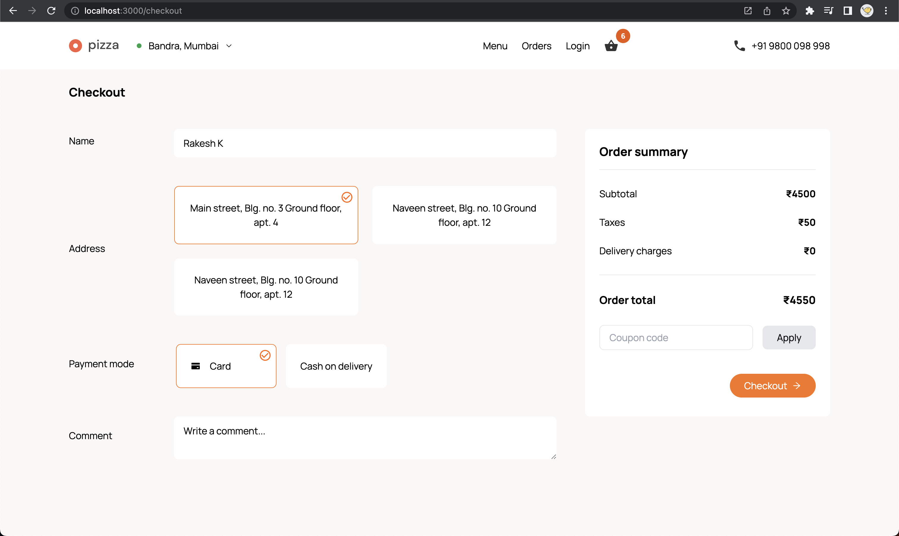

# 🍕 Pizza Ordering System – Microservices (MERN + Next.js)

A **production-ready pizza ordering platform** built using **Next.js, Node.js, Express, PostgreSQL, MongoDB, and Kafka**.  
The system follows a **microservices architecture** with independent services for authentication, catalog, billing, and notifications.

---

## 🚀 Features

- Multi-tenant pizza ordering with customizable toppings, beverages, and discount coupons
- Real-time order tracking with **WebSockets** & **Kafka event streaming**
- Secure payments via **Stripe integration**
- Role-based **Admin Panel** for product management, discounts, and order tracking
- Authentication using **JWT (RSA + HSA)** with token rotation (access & refresh tokens)
- Image uploads via **Cloudinary**
- Fully **Dockerized** services with CI/CD pipelines for automated deployment

---

## 📸 Screenshots

### 🏠 Home Page



### 🍕 Customize Pizza



### 🛠 Admin Dashboard



### 💳 Checkout



---

## 🏗 Tech Stack

**Frontend:** Next.js, React, TailwindCSS  
**Backend:** Node.js, Express, MongoDB, PostgreSQL  
**Authentication:** JWT (RSA + HSA), bcrypt  
**Payments:** Stripe  
**Messaging & Events:** Kafka, WebSockets  
**DevOps:** Docker, CI/CD Pipelines  
**Others:** Cloudinary, Nodemailer

---

## 📂 Project Structure

- `auth-service/` → User authentication & JWT token service
- `catalog-service/` → Product, toppings & menu management
- `billing-service/` → Payments, invoices & Stripe integration
- `notification-service/` → Order updates & email notifications
- `client/` → Next.js frontend for users
- `admin/` → Admin dashboard

---

## ⚙️ Getting Started

### 1️⃣ Clone the repo

```bash
git clone https://github.com/MohitCode17/mernstack-pizza-ordering-system.git
cd mernstack-pizza-ordering-system
```

## 🏆 Achievements

- ✔ Built using microservices with containerized deployment
- ✔ Production-ready authentication & payment flows
- ✔ Real-time notifications with Kafka & WebSockets
